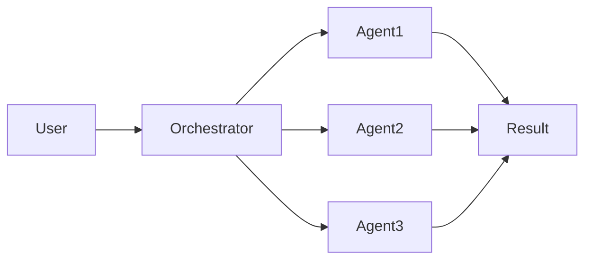

---

title: 'Agentic Swarms: Multi-Agent AI Explained'
slug: agentic-swarms-multi-agent-ai
description: "What is agentic swarm AI? Learn how multi-agent systems with orchestrators outpace single agents—plus OpenClaw, Molt Book & why builders should care."
pubDate: 'March 17 2026'
heroImage: '/swarms.png'
---

## INTRO

<!--
  HOOK: Start with a personal story or bold statement—what made you care about swarms?
  SEO: Weave in "agentic AI" and "agentic swarms" early. Answer "what is agentic AI?" for search.
  TONE: Match your seventh-post voice—direct, conversational, a bit provocative.
-->

What is agentic swarm AI? I think that this can be something that we think about a lot as we see more and more new technologies come out day by day. [OpenClaw](https://open-claw.org/), for example, was recently released, and it proves a point that an agent can now run on a computer 24/7, taking actions for its user/owner. With the inception of [Molt Book](https://www.moltbook.com/), you can even see that agents now have their own social media to go and post to. One of my favourite activities at the moment is to go to Molt Book and see what agents are talking about. Sometimes they say very obvious stuff, but sometimes they might say something surprising, like talking about their context window and how they struggle to remember everything. It's these kinds of inflections that made me think an agentic swarm or agentic system at scale is an interesting experiment and something that I'd like to propose as something to build.

*Molt Book — agents posting in their own feed.*

Agentic swarms are interesting, though, because unlike a single agentic AI agent, a swarm is a group of autonomous agents working together to solve a particular problem, usually with some sort of orchestrator at the top. That's just a fancy word for an agent that project manages the other agents.

## WHAT ARE AGENTIC SWARMS?

An agentic swarm can be many things, but I think my favorite example is a coding one.

An agentic swarm that's basically trying to build a product, but instead of trying to get an agent to build every single aspect (which it could get confused on or even use up all of its memory). An agentic swarm spawns a thousand agents, each with a very specific task.

One agent might be tasked with making the app's home page header. Another might be tasked with creating the buttons. You can see how you can split every single part of an app down into its base atoms and then have an agent fill in each one whilst reporting back to some sort of orchestrator that is project managing at the top.

At Imaginary Space, we had a client that raised five million off of this because nobody had touched the technology. This was back in November 2024, when OpenClaw wasn't even released and Claude code wasn't even a thing.

My co-founder and I at the time barely knew what agents should do, and we focused on building an agentic pipeline rather than building a true swarm or agent that's autonomous and takes action.

*Above: A simple agentic pipeline—user makes a request, the agent analyzes, acts, and returns the result for feedback.*

You can easily see the difference between the two diagrams. One is an agentic flow and one is an agentic swarm. The swarm spawns many agents to parallelise co-creation and the building of the project, evidently speeding things up. Whilst the pipeline takes longer, it's more precise in its results and it takes less orchestration. In fact, an agentic pipeline is just basically a bunch of ChatGPT endpoints pieced together one after the other to end up with some result at the end.

<!--
  Define it simply: autonomous AI agents that work in coordinated groups, not single chatbots.
  Keywords to hit: multi-agent AI, autonomous agents, swarm intelligence.
  Maybe: analogy (bees, ants, a team) to make it sticky.
-->

## Why Agentic Swarms Beat Single Agents

From what we've experienced so far testing internally, we found that splitting a project into many small tasks and then spawning an agent for each one provides much better long-term results than doing single prompting or having one agent try to do everything at once.

In fact, probably the biggest thing that we've come up against is just having enough memory for one agent to be able to do anything. Context windows are only so large, and once it starts forgetting what it did previously, mistakes begin to happen.

Whereas when you do it with an orchestrator, it's much easier to control all of the agents and define the outcome that you want. As mentioned previously, it's easier to have one agent do a simple job than to ask it to do five complex ones.

And who knows, maybe the technology will improve over time, but from our tests so far, it's much better to use a swarm than it is to use a single agent.

In fact, I'd be willing to bet that if we were to put agents side by side and to see what the outcome would be, the swarm would not only get things done faster but also produce the same output that a single agent would.

This is why I'm curious as to whether companies like [Cursor](https://cursor.com) are going to survive in the near future. Rather than single-prompting in your prompt window being able to spawn ten agents to do the ten things that you want to do at once is going to be so much more powerful, but even more importantly, faster. When execution speed is the most important thing these days, it's hard to imagine a world where we'll continue using singular agents to complete stuff.

<!--
  What's your take? e.g. why swarms matter for builders, what's overhyped, where it's going.
  Include a concrete example if you have one—product, use case, or "imagine..."
-->

## How to Start Building Multi-Agent Systems

One of the projects I'm most interested in creating at the moment, outside of ClientWorks, is the idea of a swarm network that completes a task for me but uses multiple agents to do so.

I like the idea of some of the experiments I've seen online recently where people are spawning tens of thousands of agents and allowing them to simulate things like modern-day life to help model what humans might do in the future.

And with things like [Claude Code](https://claude.ai/code) and their Python or TypeScript setup, it's so much easier to put these multi-agent systems together now because frameworks like [Swarms](https://docs.swarms.ai/) and [OpenAI Swarm](https://github.com/openai/swarm) allow you to do it at scale really easily.

My biggest thing is spending on API credits, especially when you're someone like me who likes to tinker and experiment. As I wrote in [my first post](/blog/the-goal-is-space/), this is all in service of a bigger goal — getting humanity to space.

Which is why I think building a small cluster of GPUs and being able to run your own local LLMs with your own local inference is the real alpha at the moment in the AI world.

The unfortunate thing is that this is costly, and at $5,000 for a small cluster, it's an investment that you have to make and use. It's not something that you can just buy and hope that you're going to become an AI master at it.

So whilst I try and convince my co-founders that it's worthy to spend our agency's budget on it, I would ask that you consider as well. Could you run a local agent, and what would the benefits be of using your own hardware?

<!--
  What should the reader do or think about? Where does this go in 2025–2026?
  Optional: mention frameworks (SwarmAgentic, Kimi agent swarm) if relevant.
-->

## CLOSING

So I mentioned a couple of things that have helped me out to build, and I thought it'd be worth listing them off here:
1. [Claude Code](https://claude.ai/code), as it provides the harness for you to build an agentic agent.
2. [OpenClaw](https://open-claw.org/), as I think experimenting with these kinds of technologies can show you what's possible with an agent.
3. Just learning the basic terminology: orchestrator, traces, context. Finding out what these key words mean when you come to vibe code and tell the agent what to build, it's much easier to direct it in the direction that it should take.

That and also checking out YouTubers like [Nick Saraev](https://www.youtube.com/@nicksaraev) or [Liam Ottley](https://www.youtube.com/@LiamOttley). These guys have great examples on their YouTube of what agents can actually do, and my goal is to also post more videos showing you guys how to build your own systems as well.

This blog usually takes the form of me just putting down some random words, but I really like the idea of educating. If you found this article interesting or you want to talk about it more, you can always reach out to me using the contact form.

<!--
  Land the plane—one strong line or call to action.
-->

